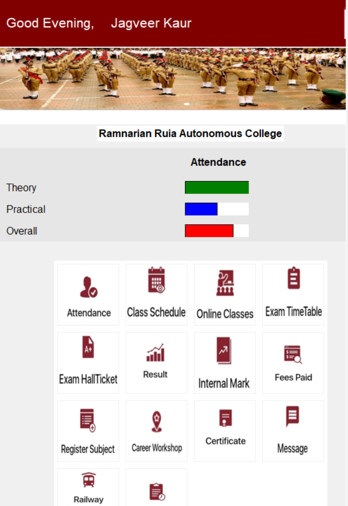
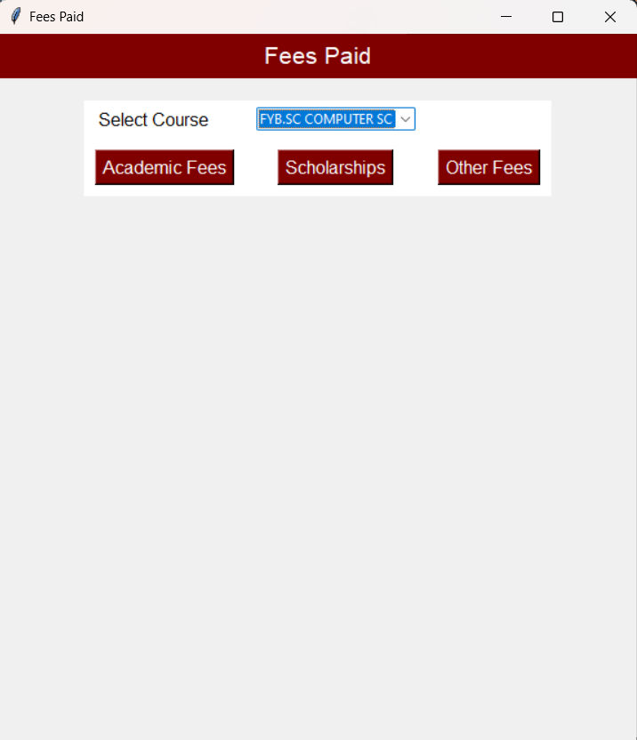
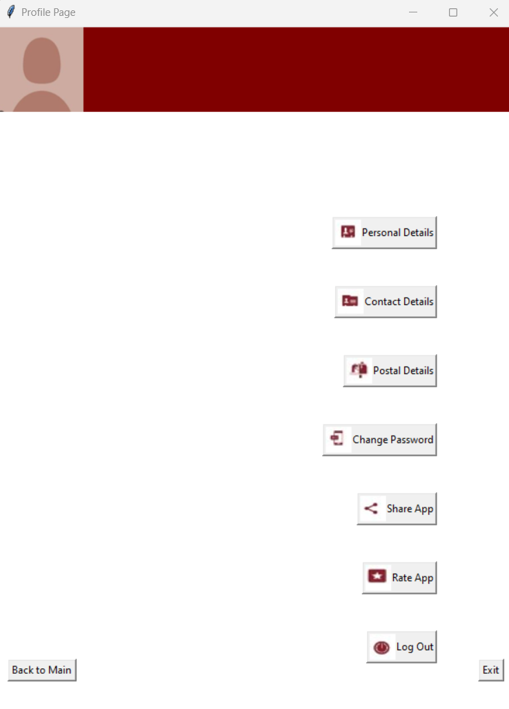
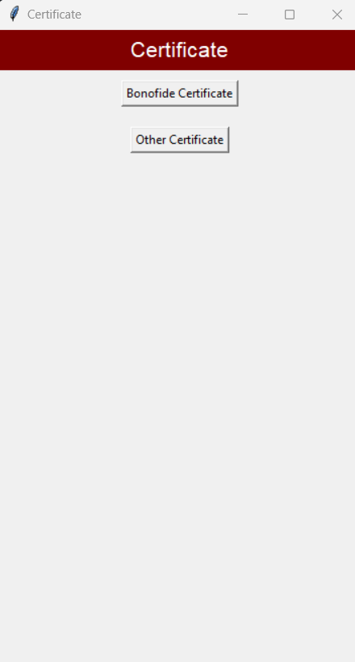
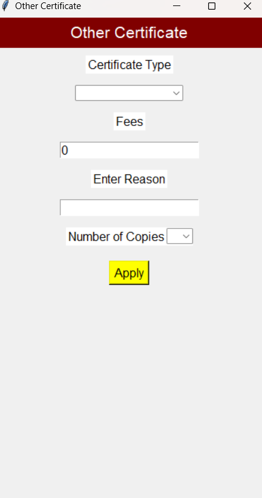
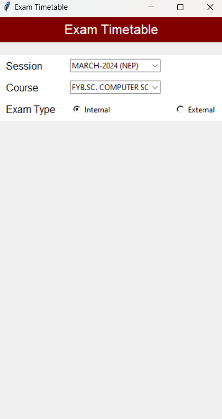

<!DOCTYPE html>
<html lang="en">
<head>
    <meta charset="UTF-8">
    <meta name="viewport" content="width=device-width, initial-scale=1.0">

</head>
<body>
    <h1>Welcome to the Student College Diary App</h1>
    
This app is designed to help students organize their academic life effectively. Below are the features included:

   <h2>Features:</h2>
     <ul>
         <li><strong>Class Schedule:</strong> Keep track of your class timings and locations.</li>
        <li><strong>Assignment Tracker:</strong> Manage your assignments with due dates and priorities.</li>
        <li><strong>Exam Schedule:</strong> Stay updated on your upcoming exams and their dates.</li>
        <li><strong>Notes:</strong> Take and organize notes for each of your subjects.</li>
        <li><strong>Attendance Tracker:</strong> Monitor your attendance for each class.</li>
        <li><strong>Events Calendar:</strong> Add important events and deadlines to your calendar.</li>
        <li><strong>Notifications:</strong> Receive reminders for assignments, exams, and events.</li>
        <li><strong>Career Page:</strong> Access links for joining career-related sessions.</li>
        <li><strong>Documents Page:</strong> Request and apply for your academic documents.</li>
        <li><strong>Results Section:</strong> View your results with marks breakdown.</li>
        <li><strong>Travel Concessions:</strong> Avail travel concessions if applicable.</li>
        <li><strong>Scholarship Tab:</strong> Explore available scholarships and apply.</li>
        <li><strong>User Authentication:</strong> Secure login system to protect your data.</li>
     </ul>
 
   <h2>Usage:</h2>
     
To use the app, simply follow these steps:

     <ol>
         <li>Sign up or log in using your credentials.</li>
         <li>Explore different sections such as class schedule, assignments, exams, etc.</li>
         <li>Add or edit entries as needed.</li>
         <li>Stay organized and on top of your academic responsibilities!</li>
     </ol>
 
   <h2>Installation:</h2>
     
There's no need for installation as the app is web-based. Simply clone the repository and start using it.

 
   <h2>Contributing:</h2>
     
If you'd like to contribute to the development of this app, feel free to fork the repository and submit a pull request with your changes.

 
   <h2>License:</h2>
     
This project is licensed under the MIT License. See the <a href="LICENSE">LICENSE</a> file for details.

 
   <h2>Contact:</h2>
     
If you have any questions or suggestions, feel free to contact. 

        
   <h2> Images </h2>
   
Following are some of the features/overall look of the diary

   
   
    
    
    
    
    
   
 </body>
 </html>
